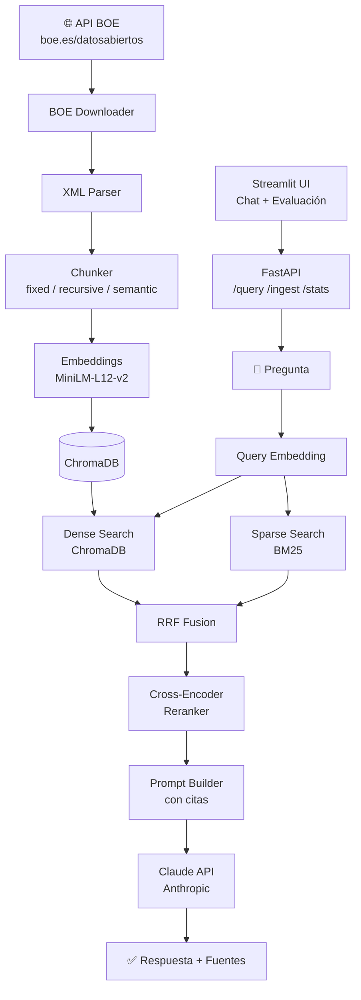

# ⚖️ RAG Document Intelligence

> Sistema de Recuperación Aumentada por Generación sobre legislación española del BOE.

[](https://python.org)
[](https://fastapi.tiangolo.com)
[](https://trychroma.com)
[](https://langchain.com)
[](https://streamlit.io)
[](https://docker.com)
[](LICENSE)

Sistema RAG de producción que permite hacer preguntas en lenguaje natural sobre documentos
legislativos reales del BOE (Boletín Oficial del Estado). Combina búsqueda semántica densa
con BM25 sparse, reranking con cross-encoder y generación con Anthropic Claude.

---

## ✨ Características Técnicas

| Componente | Implementación |
|---|---|
| **Embeddings** | `paraphrase-multilingual-MiniLM-L12-v2` (multilingüe, ideal para español) |
| **Vector Store** | ChromaDB con persistencia local + interfaz abstracta (swap a Pinecone) |
| **Búsqueda** | Híbrida: dense embeddings + BM25 sparse con Reciprocal Rank Fusion |
| **Reranking** | Cross-encoder `ms-marco-MiniLM-L-6-v2` para máxima precisión |
| **LLM** | Anthropic Claude (modo mock disponible sin API key) |
| **Chunking** | 3 estrategias: fixed, recursive, semantic — configurables por YAML |
| **Evaluación** | 4 métricas RAG: fidelidad, relevancia, precisión contexto, recall |
| **API** | FastAPI con streaming SSE, Pydantic v2, logs estructurados |
| **UI** | Streamlit con diseño personalizado, chat con citas expandibles |
| **Deploy** | Docker Compose: un comando levanta API + UI + ChromaDB |

---

## 🚀 Inicio Rápido

### Opción A: Docker (recomendado)

```bash
git clone https://github.com/lightskinhorti/rag.git
cd rag

# Configurar variables de entorno
cp .env.example .env
# Editar .env y añadir ANTHROPIC_API_KEY (opcional — funciona en modo mock sin ella)

# Levantar todos los servicios
docker compose -f docker/docker-compose.yml up --build -d

# Descargar e indexar documentos del BOE (dentro del contenedor)
docker exec rag_api python scripts/download_boe.py --dias 7 --ingestar
```

Accede a:
- **UI:** http://localhost:8501
- **API docs:** http://localhost:8000/docs

### Opción B: Desarrollo local

```bash
# 1. Instalar dependencias
make install

# 2. Configurar entorno
cp .env.example .env  # Editar y añadir ANTHROPIC_API_KEY

# 3. Descargar documentos reales del BOE (últimos 7 días)
make download-data

# 4. Indexar en ChromaDB
make ingest

# 5. Levantar API y UI (en terminales separadas)
make run-api
make run-ui
```

---

## 🏗️ Arquitectura



---

## 📁 Estructura del Proyecto

```
rag-document-intelligence/
├── src/
│   ├── ingestion/
│   │   ├── boe_downloader.py   # Descarga XML real del BOE sin autenticación
│   │   ├── loader.py           # Loaders para PDF, TXT, Markdown, XML
│   │   ├── chunker.py          # 3 estrategias de chunking
│   │   └── pipeline.py         # Orquestador de ingesta
│   ├── embeddings/
│   │   └── embedder.py         # sentence-transformers multilingüe
│   ├── retrieval/
│   │   ├── vector_store.py     # Abstracción ChromaDB
│   │   ├── hybrid_search.py    # Dense + BM25 con RRF
│   │   └── reranker.py         # Cross-encoder reranking
│   ├── generation/
│   │   ├── prompts.py          # Templates de prompt en español
│   │   └── llm.py              # Anthropic Claude + modo mock
│   ├── evaluation/
│   │   └── metrics.py          # 4 métricas RAG + informe JSON
│   ├── api/
│   │   ├── main.py             # FastAPI app + middleware
│   │   ├── models.py           # Pydantic v2 models
│   │   └── routes/             # Endpoints: /query /ingest /health /stats
│   ├── config.py               # Carga YAML + env vars
│   └── logger.py               # structlog estructurado
├── ui/
│   └── app.py                  # Streamlit con CSS personalizado
├── data/
│   ├── raw/                    # Documentos BOE descargados (git-ignorado)
│   ├── chroma_db/              # Vector store persistido (git-ignorado)
│   └── evaluation/
│       ├── eval_dataset.json   # 15 pares Q&A de referencia
│       └── results.json        # Resultados de evaluación (git-ignorado)
├── tests/
│   ├── test_ingestion.py       # Tests de carga y chunking
│   ├── test_embeddings.py      # Tests del módulo de embeddings
│   └── test_retrieval.py       # Tests de vector store y métricas
├── configs/
│   └── default.yaml            # Configuración global del sistema
├── docker/
│   ├── Dockerfile.api          # Multi-stage build para la API
│   ├── Dockerfile.ui           # Imagen para Streamlit
│   └── docker-compose.yml      # Orquestación completa
├── scripts/
│   └── download_boe.py         # CLI de descarga e ingesta
├── docs/
│   └── architecture.md         # Decisiones de diseño y trade-offs
├── Makefile                    # Comandos de desarrollo
├── requirements.txt
├── .env.example
└── .gitignore
```

---

## 🔌 API Reference

| Método | Endpoint | Descripción |
|--------|----------|-------------|
| `POST` | `/query` | Consulta principal RAG → respuesta + fuentes |
| `POST` | `/query/stream` | Igual con streaming SSE |
| `POST` | `/ingest` | Indexar documentos desde directorio |
| `POST` | `/ingest/upload` | Subir y procesar un fichero |
| `GET` | `/health` | Estado del servicio |
| `GET` | `/stats` | Estadísticas de la colección |
| `GET` | `/evaluation` | Ejecutar evaluación completa |

**Ejemplo de consulta:**

```bash
curl -X POST http://localhost:8000/query \
  -H "Content-Type: application/json" \
  -d '{
    "pregunta": "¿Cuál es la jornada laboral máxima en España?",
    "top_k": 5,
    "alpha": 0.7,
    "reranking": true
  }'
```

---

## 📊 Evaluación del Sistema

El framework evalúa el pipeline completo con 15 preguntas de referencia sobre legislación española (derechos laborales, protección de datos, derecho tributario).

| Métrica | Descripción | Estrategia |
|---------|-------------|-----------|
| **Fidelidad** | ¿La respuesta está en el contexto? | Solapamiento léxico respuesta ↔ contexto |
| **Relevancia** | ¿Responde la pregunta? | Solapamiento léxico pregunta ↔ respuesta |
| **Precisión** | ¿Los chunks son relevantes? | % chunks con términos de la pregunta |
| **Recall** | ¿Se recuperó info suficiente? | Solapamiento respuesta esperada ↔ contexto |

Ejecutar evaluación:
```bash
# Con la API activa:
make eval
# O desde la UI: Tab "Evaluación" → Ejecutar evaluación
```

---

## ⚙️ Configuración

Toda la configuración en `configs/default.yaml`. Variables de entorno sobrescriben YAML:

```yaml
embeddings:
  modelo: "sentence-transformers/paraphrase-multilingual-MiniLM-L12-v2"

chunking:
  estrategia_chunking: "recursive"  # fixed | recursive | semantic
  chunk_size: 512
  chunk_overlap: 64

retrieval:
  top_k: 5
  hybrid_alpha: 0.7      # 1.0=solo dense | 0.0=solo BM25
  reranking_habilitado: true

generation:
  modelo: "claude-sonnet-4-6"
  mock_mode: false       # true = sin API key, respuestas simuladas
```

Variables de entorno (`.env`):
```env
ANTHROPIC_API_KEY=sk-ant-...   # Obligatoria para respuestas reales
MOCK_LLM=false                 # Poner true para demos sin API
CHROMA_PERSIST_DIR=./data/chroma_db
LOG_LEVEL=info
```

---

## 🧪 Tests

```bash
# Todos los tests
make test

# Con cobertura
make test-coverage

# Un módulo específico
pytest tests/test_retrieval.py -v
```

---

## 🛠️ Comandos Útiles

```bash
make help              # Lista todos los comandos disponibles
make download-data     # Descarga últimos 7 días del BOE
make ingest            # Indexa data/raw en ChromaDB
make download-and-ingest  # Descarga + indexa en un paso
make run-api           # Servidor en http://localhost:8000
make run-ui            # UI en http://localhost:8501
make docker-up         # Todo con Docker
make stats             # Estadísticas de la colección (API activa)
make eval              # Ejecutar evaluación (API activa)
```

---

## 📦 Dependencias Principales

- **anthropic** — LLM Claude para generación
- **sentence-transformers** — Embeddings multilingües locales
- **chromadb** — Vector store persistente
- **rank-bm25** — Búsqueda sparse BM25
- **fastapi** + **uvicorn** — API asíncrona de alta velocidad
- **streamlit** + **plotly** — Interfaz y visualización de métricas
- **lxml** — Parseo de XML del BOE
- **structlog** — Logging estructurado

---

## 🔮 Mejoras Futuras

- [ ] Integración con Pinecone para escala cloud
- [ ] Pipeline multi-documento con citaciones cruzadas
- [ ] Fine-tuning del embedder sobre corpus jurídico español
- [ ] Evaluación con LLM judge (RAGAS framework)
- [ ] Soporte para búsqueda por fecha de publicación
- [ ] Caché semántico de consultas frecuentes
- [ ] Monitorización con Prometheus + Grafana
- [ ] Agentes multi-step para consultas complejas

---

## 👤 Autor

**Javier Hortigüela Valiente** — Data Engineer / ML Engineer

- GitHub: [@lightskinhorti](https://github.com/lightskinhorti)

---

## 📄 Licencia

MIT License. Ver [LICENSE](LICENSE).
