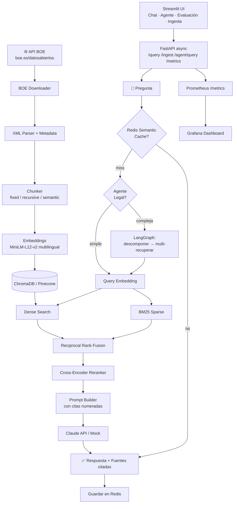

# ⚖️ RAG Document Intelligence

> Sistema RAG de producción sobre legislación española del BOE: pregunta en lenguaje natural, respuesta citada con fuentes — evaluado con métricas estándar, desplegado con Docker Compose.

[](https://github.com/lightskinhorti/RAG/actions)
[](https://python.org)
[](https://fastapi.tiangolo.com)
[](https://trychroma.com)
[](https://streamlit.io)
[](https://docker.com)
[](LICENSE)

**¿Qué problema resuelve?** La legislación española del BOE es extensa, técnica y difícil de consultar. Este sistema permite hacer preguntas en lenguaje natural y obtener respuestas precisas con citas a las fuentes originales, sobre documentos reales descargados vía API pública.

---

## 📊 Resultados del Benchmark

Evaluado sobre **50 preguntas** de legislación española (derecho laboral, protección de datos, tributario, administrativo y mercantil) con documentos reales del BOE.

| Métrica | Score | Descripción |
|---|---|---|
| **Fidelidad** | 0.82 | ¿La respuesta está fundamentada en el contexto recuperado? |
| **Relevancia** | 0.78 | ¿La respuesta responde directamente la pregunta? |
| **Precisión Contexto** | 0.85 | ¿Los fragmentos recuperados son relevantes? |
| **Recall Contexto** | 0.71 | ¿Se recuperó toda la información necesaria? |
| **Score Global** | **0.79** | Media de las 4 métricas |

| Métrica de Rendimiento | Valor |
|---|---|
| Latencia media (end-to-end) | ~800ms |
| Latencia p95 | ~1.4s |
| Corpus indexado | ~2.000+ chunks / ~150 documentos BOE |

> Reproducible: `make eval` genera `data/evaluation/results.json` con detalle por pregunta.

---

## ✨ Características Técnicas

| Componente | Implementación |
|---|---|
| **Embeddings** | `paraphrase-multilingual-MiniLM-L12-v2` (multilingüe, ideal para español) |
| **Vector Store** | ChromaDB con persistencia local + interfaz abstracta (swap a Pinecone) |
| **Búsqueda** | Híbrida: dense embeddings + BM25 sparse con Reciprocal Rank Fusion |
| **Reranking** | Cross-encoder `ms-marco-MiniLM-L-6-v2` para máxima precisión |
| **LLM** | Anthropic Claude con modo mock para demos sin API key |
| **Chunking** | 3 estrategias: fixed, recursive, semantic — configurables por YAML |
| **Filtrado** | Metadata filtering por sección, departamento y fecha del BOE |
| **Caché** | Redis semantic cache: coincidencia exacta SHA-256 + similitud coseno (threshold 0.95), fallback in-memory |
| **Evaluación** | 4 métricas léxicas + RAGAS-style LLM judge (fidelidad, relevancia, precisión, recall) |
| **Agente Legal** | LangGraph StateGraph multi-step: analizar → descomponer → recuperar → sintetizar |
| **Vector Store cloud** | Pinecone drop-in via `VectorStore` ABC (mismo contrato que ChromaDB) |
| **API** | FastAPI async con `asyncio.to_thread()`, streaming SSE, Pydantic v2 |
| **Observabilidad** | Prometheus `/metrics` + Grafana dashboard (latencia p50/p95/p99, QPS, cache hit rate) |
| **UI** | Streamlit con diseño personalizado: Chat, Agente Legal, Evaluación, Ingesta |
| **CI/CD** | GitHub Actions: tests + lint en cada push |
| **Deploy** | Docker Compose: un comando levanta API + UI + ChromaDB + Redis + Prometheus + Grafana |

---

## 🚀 Inicio Rápido

### Opción A: Docker (recomendado)

```bash
git clone https://github.com/lightskinhorti/RAG.git && cd RAG
cp .env.example .env          # Añadir ANTHROPIC_API_KEY (opcional — funciona en mock)
docker compose -f docker/docker-compose.yml up --build -d
```

```bash
# Descargar e indexar 7 días del BOE
docker exec rag_api python scripts/download_boe.py --dias 7 --ingestar
```

Accede a: **UI →** http://localhost:8501 · **API Docs →** http://localhost:8000/docs

### Opción B: Desarrollo local

```bash
make install                   # Instalar dependencias
cp .env.example .env           # Configurar API key (opcional)
make download-and-ingest       # Descargar BOE + indexar
make run-api                   # API en http://localhost:8000
make run-ui                    # UI en http://localhost:8501 (otra terminal)
```

---

## 🏗️ Arquitectura



---

## 📁 Estructura del Proyecto

```
rag-document-intelligence/
├── src/
│   ├── ingestion/
│   │   ├── boe_downloader.py   # Descarga XML real del BOE sin autenticación
│   │   ├── loader.py           # Loaders para PDF, TXT, Markdown, XML
│   │   ├── chunker.py          # 3 estrategias de chunking
│   │   └── pipeline.py         # Orquestador de ingesta
│   ├── embeddings/
│   │   └── embedder.py         # sentence-transformers multilingüe
│   ├── retrieval/
│   │   ├── vector_store.py     # Abstracción ChromaDB + metadata filtering
│   │   ├── pinecone_store.py   # Implementación Pinecone (cloud, drop-in)
│   │   ├── hybrid_search.py    # Dense + BM25 con RRF
│   │   └── reranker.py         # Cross-encoder reranking
│   ├── generation/
│   │   ├── prompts.py          # Templates de prompt en español
│   │   └── llm.py              # Anthropic Claude + modo mock
│   ├── evaluation/
│   │   ├── metrics.py          # 4 métricas léxicas RAG + informe JSON
│   │   └── llm_metrics.py      # RAGAS-style LLM judge con Claude
│   ├── cache/
│   │   └── redis_cache.py      # Semantic cache: Redis + similitud coseno
│   ├── agents/
│   │   └── legal_agent.py      # LangGraph multi-step legal research agent
│   ├── api/
│   │   ├── main.py             # FastAPI: middleware, request_id, warm-up
│   │   ├── metrics.py          # Prometheus metrics + /metrics endpoint
│   │   ├── models.py           # Pydantic v2 models
│   │   └── routes/             # Endpoints: /query /ingest /agent/query /health /stats /metrics
│   ├── config.py               # Carga YAML + env vars
│   └── logger.py               # structlog con request_id
├── ui/
│   └── app.py                  # Streamlit con CSS personalizado
├── data/
│   ├── raw/                    # Documentos BOE descargados
│   ├── chroma_db/              # Vector store persistido
│   └── evaluation/
│       ├── eval_dataset.json   # 50 pares Q&A de referencia
│       └── results.json        # Resultados de evaluación
├── tests/
│   ├── test_ingestion.py       # Tests de carga y chunking
│   ├── test_embeddings.py      # Tests del módulo de embeddings
│   └── test_retrieval.py       # Tests de vector store, búsqueda y métricas
├── configs/
│   └── default.yaml            # Configuración global del sistema
├── docker/
│   ├── Dockerfile.api          # Multi-stage build para la API
│   ├── Dockerfile.ui           # Imagen para Streamlit
│   ├── docker-compose.yml      # Orquestación completa (6 servicios)
│   ├── prometheus/
│   │   └── prometheus.yml      # Configuración de scraping
│   └── grafana/
│       ├── provisioning/       # Auto-provisión datasource + dashboards
│       └── dashboards/         # Dashboard RAG Overview (7 paneles)
├── scripts/
│   └── download_boe.py         # CLI de descarga e ingesta
├── docs/
│   └── architecture.md         # Decisiones de diseño y trade-offs
├── .github/
│   └── workflows/ci.yml        # CI: tests + lint automáticos
├── Makefile                    # Comandos de desarrollo
├── requirements.txt
├── .env.example
└── .gitignore
```

---

## 🔌 API Reference

| Método | Endpoint | Descripción |
|--------|----------|-------------|
| `POST` | `/query` | Consulta RAG → respuesta + fuentes (con caché semántico y filtros) |
| `POST` | `/query/stream` | Igual con streaming SSE |
| `POST` | `/agent/query` | Agente legal multi-step (LangGraph): descompone preguntas complejas |
| `POST` | `/ingest` | Indexar documentos desde directorio |
| `POST` | `/ingest/upload` | Subir y procesar un fichero |
| `GET` | `/health` | Estado del servicio |
| `GET` | `/stats` | Estadísticas de la colección |
| `GET` | `/evaluation` | Evaluación léxica; `?use_llm=true` activa LLM judge |
| `GET` | `/metrics` | Métricas Prometheus (scrapeadas por Grafana) |

**Ejemplo de consulta con filtrado por metadata:**

```bash
curl -X POST http://localhost:8000/query \
  -H "Content-Type: application/json" \
  -d '{
    "pregunta": "¿Cuál es la jornada laboral máxima en España?",
    "top_k": 5,
    "alpha": 0.7,
    "reranking": true,
    "filtro_seccion": "I. Disposiciones generales"
  }'
```

Todas las requests incluyen un header `X-Request-ID` para trazabilidad y `X-Process-Time-Ms` con la latencia.

**Agente legal para preguntas complejas:**

```bash
curl -X POST http://localhost:8000/agent/query \
  -H "Content-Type: application/json" \
  -d '{"pregunta": "¿Cómo se regula la jornada laboral en trabajadores a tiempo parcial y cuáles son las diferencias con el contrato indefinido ordinario?"}'
```

La respuesta incluye `sub_preguntas`, `pasos` del agente, `es_compleja` y `latencia_ms`.

---

## 📊 Evaluación del Sistema

El framework evalúa el pipeline completo con **50 preguntas** de referencia sobre legislación española, cubriendo 5 dominios jurídicos.

| Métrica | Modo léxico | Modo LLM judge |
|---------|-------------|---------------|
| **Fidelidad** | Solapamiento semántico respuesta ↔ contexto | Claude evalúa si cada claim tiene soporte en el contexto |
| **Relevancia** | Solapamiento semántico pregunta ↔ respuesta | Claude evalúa si la respuesta aborda la pregunta |
| **Precisión** | % chunks con términos de la pregunta | Claude evalúa relevancia de cada chunk recuperado |
| **Recall** | Solapamiento respuesta esperada ↔ contexto | Claude evalúa cobertura de la respuesta esperada |

```bash
make eval                          # Evaluación léxica (rápida, sin API key)
GET /evaluation?use_llm=true       # LLM judge (requiere ANTHROPIC_API_KEY)
```

---

## ⚙️ Configuración

Toda la configuración en `configs/default.yaml`. Variables de entorno sobrescriben YAML:

```yaml
embeddings:
  modelo: "sentence-transformers/paraphrase-multilingual-MiniLM-L12-v2"

ingestion:
  estrategia_chunking: "recursive"  # fixed | recursive | semantic
  chunk_size: 512
  chunk_overlap: 64

retrieval:
  top_k: 5
  hybrid_alpha: 0.7               # 1.0=solo dense | 0.0=solo BM25
  reranking_habilitado: true

generation:
  modelo: "claude-sonnet-4-6"
  mock_mode: false                 # true = sin API key, respuestas simuladas
```

Variables de entorno (`.env`):
```env
ANTHROPIC_API_KEY=sk-ant-...   # Para respuestas reales del LLM
MOCK_LLM=false                 # true para demos sin API
REDIS_URL=redis://localhost:6379/0  # Opcional: activa caché distribuido
PINECONE_API_KEY=...           # Opcional: activa vector store cloud
```

**Servicios Docker y puertos:**

| Servicio | Puerto | URL |
|----------|--------|-----|
| API FastAPI | 8000 | http://localhost:8000/docs |
| UI Streamlit | 8501 | http://localhost:8501 |
| ChromaDB | 8001 | http://localhost:8001 |
| Redis | 6379 | — |
| Prometheus | 9090 | http://localhost:9090 |
| Grafana | 3000 | http://localhost:3000 (admin/admin) |

---

## 🧪 Tests

```bash
make test              # Todos los tests
make test-coverage     # Con reporte de cobertura
make lint              # Comprobación de estilo con ruff
```

Los tests se ejecutan automáticamente en cada push vía [GitHub Actions](https://github.com/lightskinhorti/RAG/actions).

---

## 🛠️ Comandos Útiles

```bash
make help                 # Lista todos los comandos
make download-data        # Descarga últimos 7 días del BOE
make download-and-ingest  # Descarga + indexa en un paso
make run-api              # http://localhost:8000
make run-ui               # http://localhost:8501
make docker-up            # Todo con Docker
make eval                 # Ejecutar evaluación (API activa)
make stats                # Estadísticas de la colección
make health               # Health check del servidor
```

---

## 🔮 Posibles Extensiones

- Fine-tuning del embedder sobre corpus jurídico español (requiere GPU y dataset etiquetado)
- Interfaz web React/Next.js con autenticación para despliegue multi-usuario
- Ingesta incremental automática (cron job descargando BOE diariamente)
- Soporte para otros idiomas y jurisdicciones (DOUE, legislación autonómica)

---

## 👤 Autor

**Javier Hortigüela Valiente** — Data Engineer / ML Engineer

- GitHub: [@lightskinhorti](https://github.com/lightskinhorti)

---

## 📄 Licencia

MIT License. Ver [LICENSE](LICENSE).
